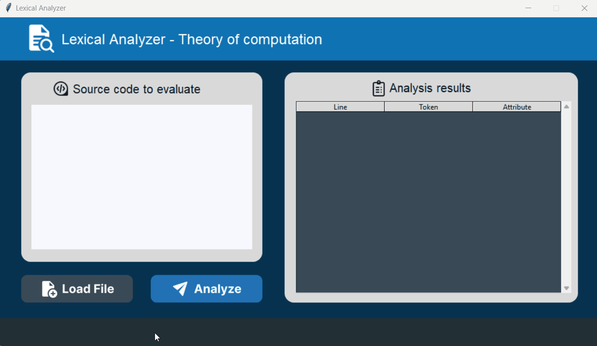

# Lexical Analyzer Project


[](https://github.com/psf/black)
[](https://github.com/ahmadawais/Emoji-Log/)


This project consists of a basic Lexical Analyzer built using Python and a Tkinter GUI for the Theory of Computation class.

It reads raw source code, identifies lexemes, and generates tokens, laying the foundation for parsing and syntax analysis.

## :pushpin: Features
:white_check_mark: Tokenizes source code into keywords, identifiers, numbers, and operators.
:white_check_mark: Built-in finite state machine (FSM) to ensure proper token recognition.
:white_check_mark: Tkinter GUI for an interactive and user-friendly experience.
:white_check_mark: Error Handling: Displays syntax errors with expected inputs.
:white_check_mark: Automated Testing: Includes unit tests with pytest.

## :rocket: Built With
- **Programming Language**: Python
- **Testing Framework**: Pytest

##  :wrench: Setup

1. Clone this 📂 repository.
2. `cd` into it.
3. Set up a virtual environment
``` bash
python -m venv venv  
source venv/bin/activate 
# On Windows, use `venv\Scripts\activate`  
```
4. Install dependencies:
``` bash
pip install -r requirements.txt 
```

## :computer: How to use?

To use the lexical analyzer, run the following:
``` bash
python main.py 
```
1. Input source code via the GUI or choose the file by clicking on 'Load File'.
2. Click "Analyze" to tokenize the input.
3. View the tokenized result in the table.
4. Errors (if any) will be highlighted with expected inputs.

## :camera_flash: Screenshots

:white_check_mark: Successful Analysis:



:x: Error Detection:


## 🧪 Testing
To run tests using Pytest, execute:
``` python
pytest -v
```

## :notebook: Blog Explanation

Check out my post series for a detailed explanation of how this project was developed:

[Creating a Lexical Analyzer for Theory of Computation](https://saul-lara.hashnode.dev/series/lexical-analyzer)


## :thought_balloon: Conclusion
This project is a demonstration of how a Lexical Analyzer can be implemented, with a focus on Finite-State Automata, a powerful and helpful tool.

## :green_book: License

Code in this repository is open-sourced software licensed under the [GPL-3.0 license](https://opensource.org/licenses/GPL-3.0).  
See the [LICENSE.md](https://github.com/Saul-Lara/Lexical-Analyzer/blob/master/LICENSE) file for details.

Saul Lara

---